# OpenAI Workbook Overview
Workbook to overview the OpenAI instances deployed on Azure.

## Introduction
With this workbook, we want to achieve a comprehensive and easy-to-use dashboard that can help us monitor and manage the openai instances that we have deployed. We want to show various metrics and statistics that can help us identify any issues or opportunities for improvement in our openai usage and performance.
- How many openai instances do we have and what are their statuses?
- How many data models we deployed for each instance? Are we reaching the limit of tokens?
- How much prompt tokens for Data model are we using for each openai instance and how does it compare to the allocated resources?
- How many queries are we sending to each openai instance and what is the average response time and latency?
- What are the most common errors or failures that we encounter with each openai instance?
- How many openAI instances can we need to improve our efficiency and quality?
To answer these questions, we have designed several graphs and tables that display the relevant data and information for each openai instance. In the following sections, we will explain the details of each graph and how to interpret them.

## What do we want to show and why (frequent client asks/problems) -> explain details of each graph
One of the main questions that we want to answer is how many openAI instances can we need to improve our efficiency and quality. This depends on several factors, such as the number of users, the complexity of the queries, the availability of the resources, and the budget constraints. 
To help us estimate the optimal number of openAI instances for our needs, we have created a graph that shows the relationship between the number of instances and the performance metrics, such as accuracy, speed, and performance.
Based on that we can see if we require PTUs to provide a guarantee SLA.

### Explained workbook

First line there's the link with the default quotas.
Then select TimeRange the openAI instance and the workspace where you send the logs.
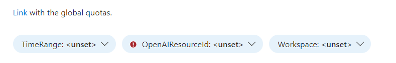
Select TimeRange , the OpenAI Instance and  Log analytics Workspace were you send the logs.

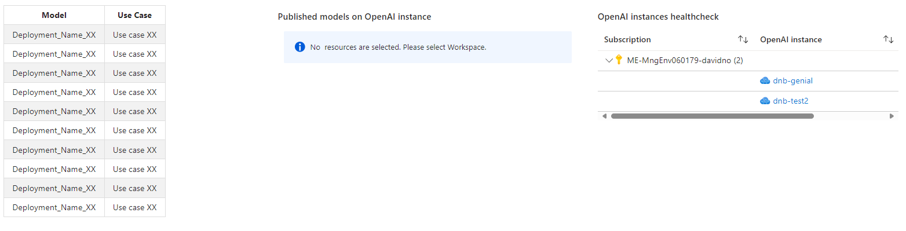
On the left it's a markdown to manually tune to know which Deployment names is using each Usecase, on the middle it shows which deployment it's deployed on each instance and on the left it checks the health of the service on the selected Timerange.

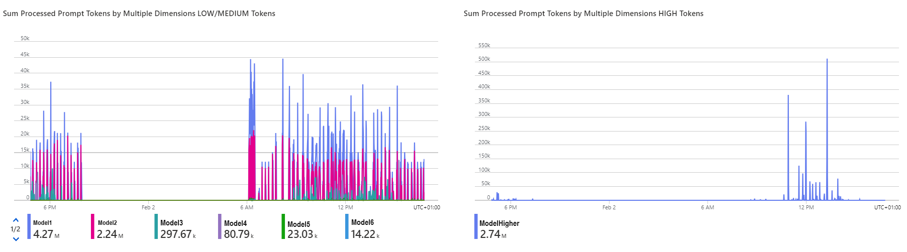
There are two graphs on the left it's necessary to tune the deployment names higher than 100k, and on the right include just the deployment names higher than 100k.
Go to section **Fine tunning of the Workbook once deployed** to do it.

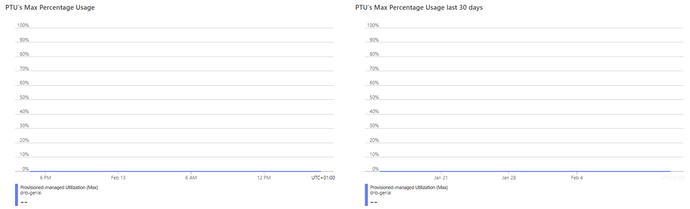
The left graph shows the maxium PTU's percentage of the models on the selected time range, and on the right the same value for the last 30 days.

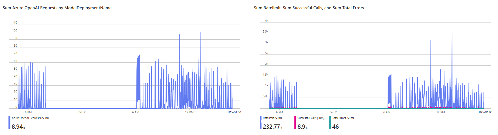
The left graph shows the number of requests and on the right graph it shows the RateLimit with the successfull requests and total Errors.

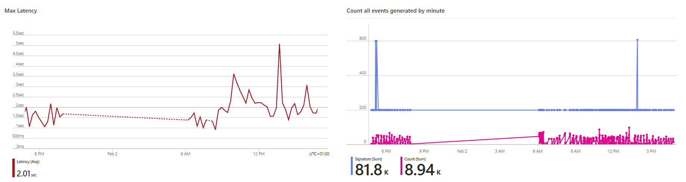
The left graph shows the latency of the service and on the right graph the number of events exported on the workspace.

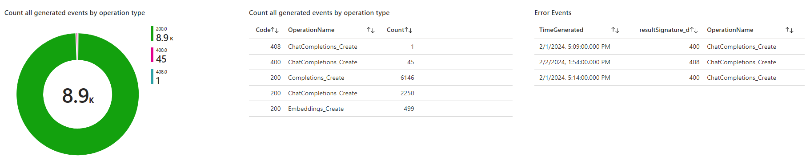
The left graph it shows a donnut to see how many events we got, on the middle the operations for each assignature and on the right side we can see the  >=400 errors.

## Requirements
We require 2 different rights to get all the graphs.

*	Reader access to the OpenAI instances to check azure metrics values from the instances.

*	Export diagnostic settings (Request and Response Logs)  and reader access to the log analytics instance or at least on the AzureDiagnostics table.

## How to setup things

There are two different tasks to prepare the workbook:

* Export diagnostic settings, follow this steps:

    * Login to [Azure Portal](https://portal.azure.com/) 
    * Go to _'Azure OpenAI'_ select the instances that you want to monitor.
    * Under Monitoring  select Diagnostic Settings and add Diagnostic settings --> select Request and Response Logs and select your workspace on Send to Log Analytics workspace.

        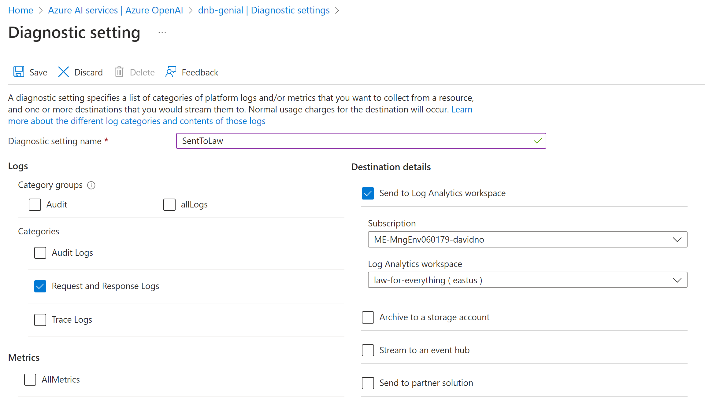

* Deploy the workbook, we have two ways:

    * (**Recommended**) Deploy it using the ARM deployment link:

        | Deployment Type | Link |
        |:--|:--|
        | Azure portal UI | |

    * (**Manual**)Importing this Workbook to your Azure environment.

        Follow this steps:

        * Login to [Azure Portal](https://portal.azure.com/) 
        * Go to _'Azure Workbooks'_ and select Create

        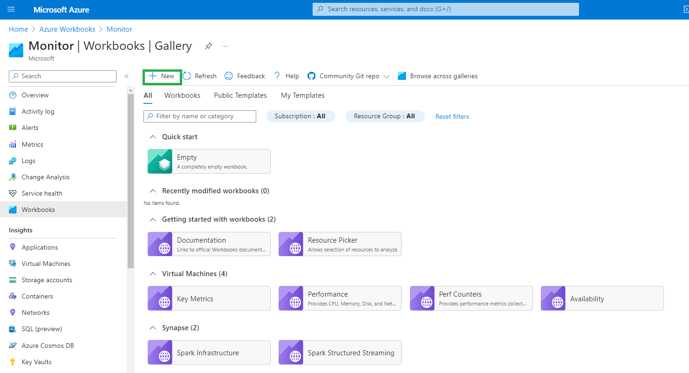

        * Click on _'+ New'_
        * Open the Advanced Editor using the _'</>'_ button on the toolbar

        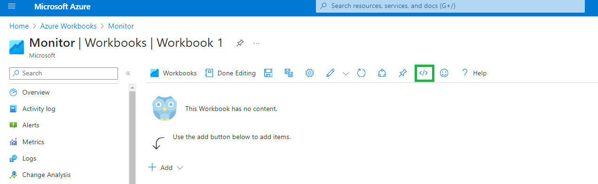

        * Select the _'Gallery Template'_ (step 1)
        * Replace the JSON in the gallery template to the [OpenAI Instance Overview workbook](https://raw.githubusercontent.com/2FDavidNogueraBuxeda/2FOpenAI_workbook_overview/main/workbooks/gallery_template/OverviewOpenAI.workbook
        ) (step 2)
        * Click _'Apply'_ (step 3)

        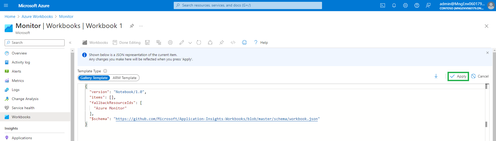

        * Click in the ‘Save’ button on the toolbar

        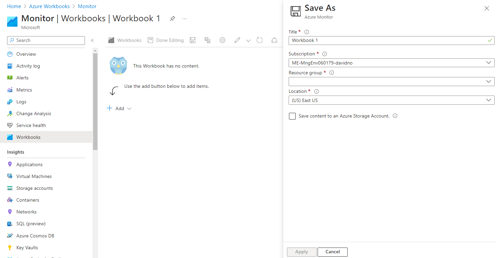

        * Select a name and where to save the Workbook:

        * Title: _'OPENAI INSTANCE OVERVIEW'_
        * Subscription: _Subscription Name_
        * Resource group: _Resource Group Name_
        * Location: _Region_
        * Click _'Save'_
        
        The Workbook is ready to use!

        * From Azure portal search for _'Log Analytics Workspace'_ and click on your chosen Log Analytics Workspace
        * Click on workbooks
        * Click on _'OPENAI INSTANCE OVERVIEW'_ Workbook.

Start using the Workbook and review your OPENAI INSTANCE OVERVIEW workbook.

## Fine tunning of the Workbook once deployed

There's a group section fo two graphs LOW/MEDIUM and HIGH tokens that it's necessary to customize it, just edit.

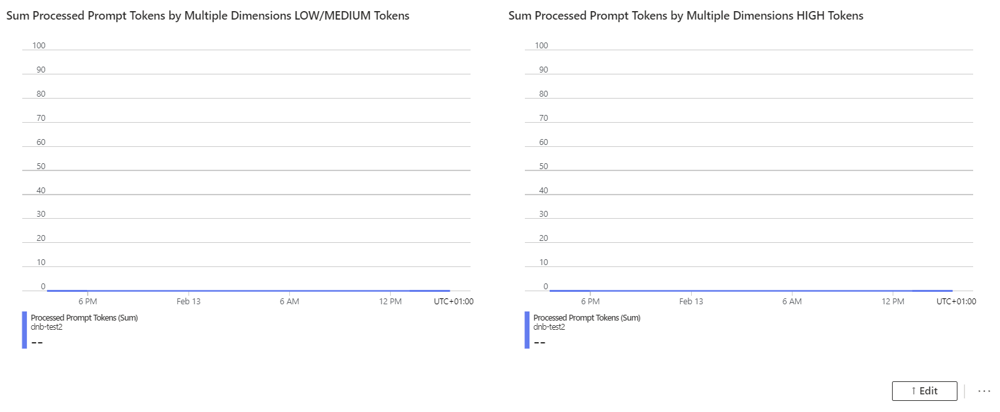

On the Low and Medium tokens graph, exclude the deployment models names higher than 100k.
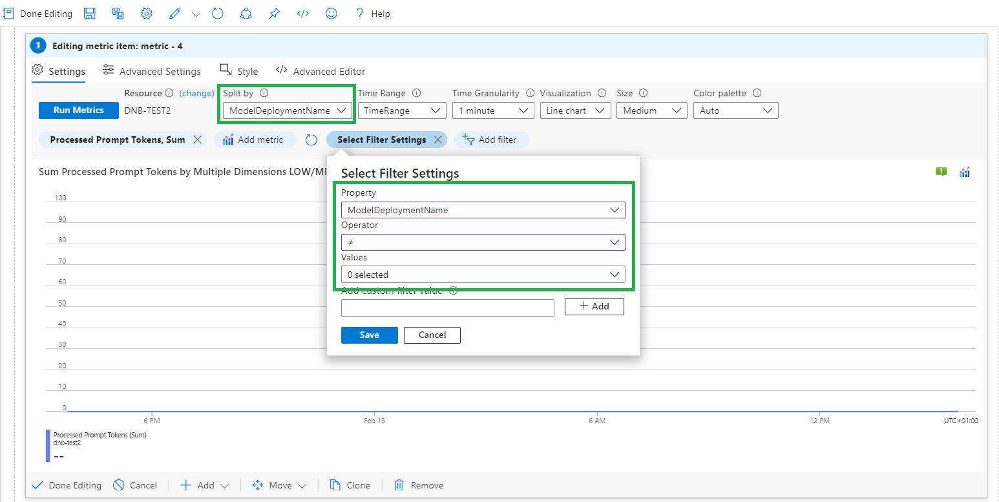

On the High tokens graph, include the deployment models names higher than 100k.
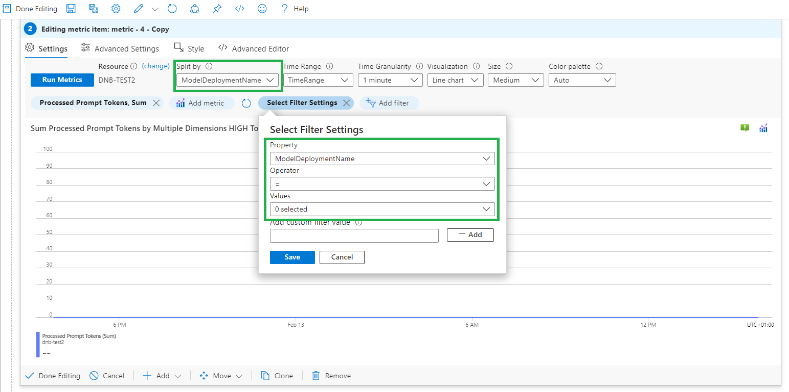

## Troubleshooting

In case you get this error, it's because the properties_s column doesn't exist on the selected Log analytics workspace or the name has changed.
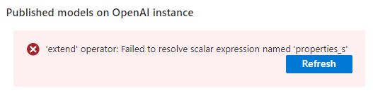

In case you get this error, it's because the resultSignature_d column doesn't exist on the selected Log analytics workspace or the name has changed.
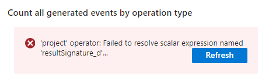

